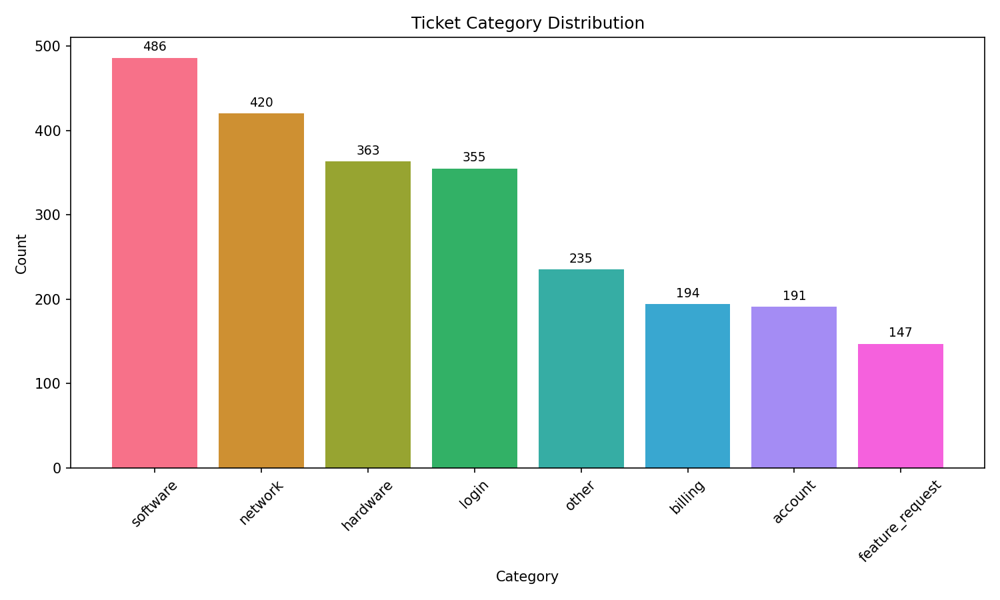
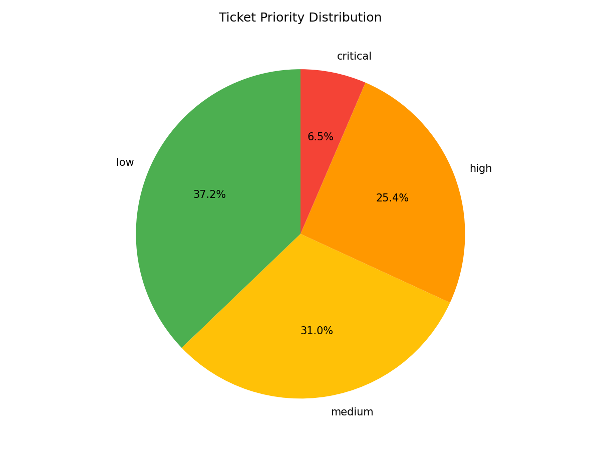
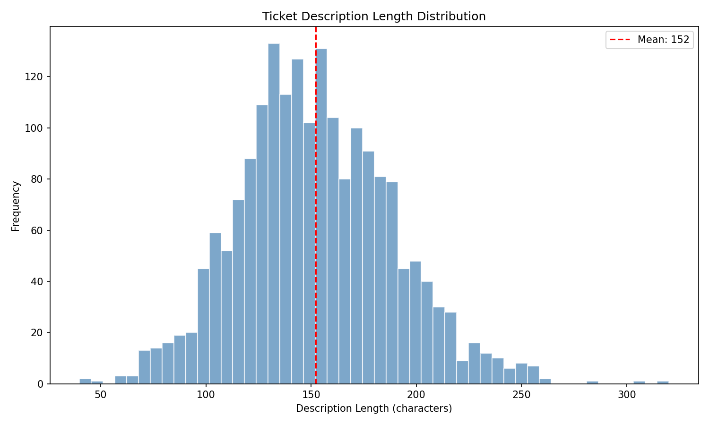
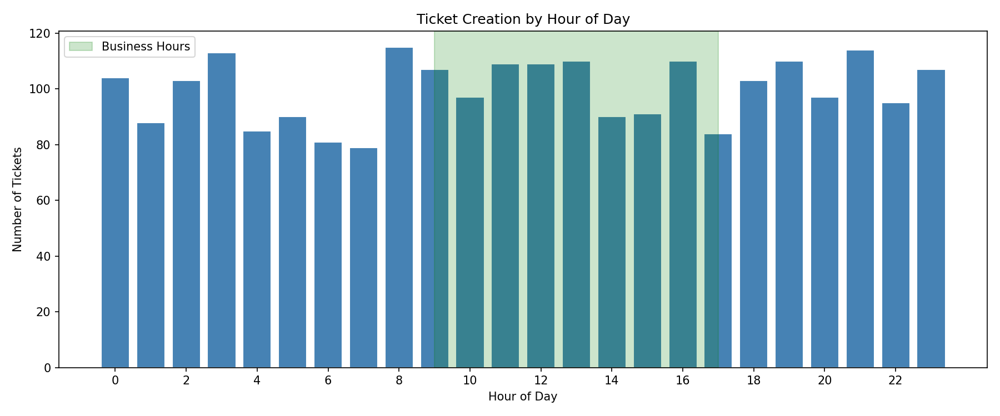
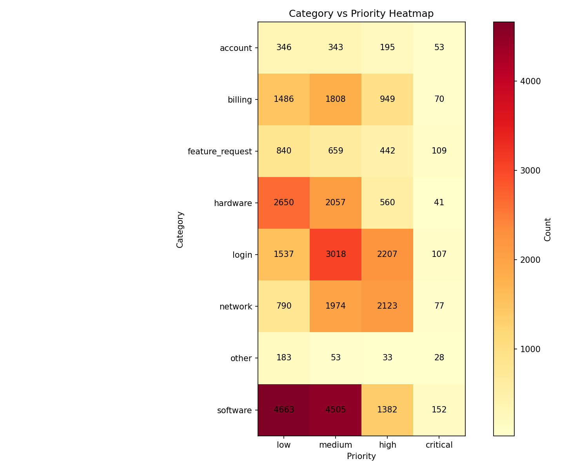

# BlueClue Ticket Data - Exploratory Data Analysis Report

**Generated:** 2026-04-06T09:28:55.103754

## 1. Dataset Overview

- **Total Records:** 3288
- **Unique Categories:** 8
- **Unique Priorities:** 4
- **Date Range:** 2025-03-20T05:03:07.010990 to 2026-03-31T15:54:29.697860
- **Records with Resolution:** 2591
- **AI Classified Records:** 3288

## 2. Key Insights

- ✓ Good dataset size (3288 records) for initial ML training.
- ✓ Category classes are reasonably balanced.
- ✓ Data quality score is good (100.0/100).

## 3. Category Distribution

- **Class Balance Status:** balanced
- **Imbalance Ratio:** 1.71:1

| Category | Count | Percentage |
|----------|-------|------------|
| feature_request | 509 | 15.48% |
| software | 504 | 15.33% |
| network | 439 | 13.35% |
| account | 400 | 12.17% |
| billing | 390 | 11.86% |
| hardware | 381 | 11.59% |
| login | 368 | 11.19% |
| other | 297 | 9.03% |

## 4. Priority Distribution

- **Critical Tickets:** 10.13%
- **High Priority (Critical + High):** 36.34%

| Priority | Count | Percentage |
|----------|-------|------------|
| low | 1129 | 34.34% |
| medium | 964 | 29.32% |
| high | 862 | 26.22% |
| critical | 333 | 10.13% |

## 5. Text Analysis

### Description Statistics
- **Average Length:** 157.09 characters
- **Average Word Count:** 26.93 words
- **Min/Max Length:** 40 / 320
- **Empty Descriptions:** 0

## 6. Temporal Patterns

- **Business Hours Tickets:** 38.26%
- **After Hours Tickets:** 61.74%
- **Weekday vs Weekend:** 71.68% / 28.32%
- **Peak Hour:** 10:00
- **Peak Day:** Friday

## 7. Data Quality Assessment

**Data Quality Score:** 100.0/100

### Issues Detected
- Missing Descriptions: 0
- Missing Subjects: 0
- Short Descriptions (<20 chars): 0
- Potential Duplicates: 1987
- Invalid Categories: 0
- Invalid Priorities: 0

### Summary
- Potential duplicates detected: 1987 (60.4%)

## 8. Recommendations for ML Training

5. **Feature Engineering:** Utilize temporal features (hour, day) as they show patterns
6. **Cross-Validation:** Use stratified k-fold CV due to class imbalance

---
*Report generated by BlueClue ML Pipeline*