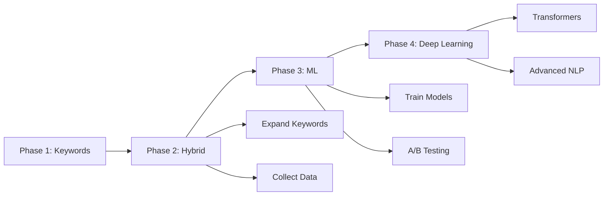

# BlueClue AI Classification System Documentation

## Overview

The BlueClue AI Classification System is a keyword-based ticket classifier designed to automatically categorize and prioritize customer support tickets. This implementation serves as an initial solution that provides immediate value while establishing the foundation for future advanced AI integration.

## System Architecture

### Components

1. **Classifier Core** (`blueclue/ai/src/classifier.py`)
   - `TicketClassifier` class implementing keyword-based classification
   - SpaCy NLP for text preprocessing and lemmatization
   - Rule-based matching with confidence scoring

2. **API Service** (`blueclue/ai/app.py`)
   - Flask REST API exposing classification endpoints
   - CORS-enabled for frontend integration
   - Health check and error handling

## Inputs

### API Endpoint: `/classify`

**HTTP Method:** POST

**Request Format:**
```json
{
  "text": "The ticket description text"
}
```

**Required Fields:**
- `text` (string): The support ticket description to classify
  - Must be non-empty
  - Accepts natural language text
  - Recommended length: 10-500 characters

**Request Headers:**
```
Content-Type: application/json
```

### Input Processing

The classifier performs the following preprocessing steps:

1. **Normalization**: Convert text to lowercase
2. **Tokenization**: Split text into individual tokens using SpaCy
3. **Lemmatization**: Reduce words to their base form (e.g., "crashes" → "crash")
4. **Stop Word Removal**: Filter out common words that don't contribute to classification
5. **Keyword Matching**: Compare processed text against predefined keyword patterns

## Outputs

### Classification Response

**HTTP Status:** 200 OK (on success)

**Response Format:**
```json
{
  "success": true,
  "input": "Original ticket text",
  "classification": {
    "category": "technical",
    "priority": "high",
    "confidence": 0.67,
    "fallback_used": false,
    "keywords_matched": {
      "category": ["error", "crash", "broken"],
      "priority": ["urgent", "critical"]
    }
  },
  "timestamp": "2026-02-02T14:30:00.123456"
}
```

### Output Fields

#### Category
Classifies the ticket into one of the following categories:

| Category | Description | Example Keywords |
|----------|-------------|------------------|
| `technical` | Technical issues, bugs, errors | error, bug, crash, not working, broken, timeout, slow |
| `billing` | Payment and subscription issues | payment, charge, invoice, refund, subscription, price |
| `account` | User account and authentication | login, password, access, username, reset, profile |
| `feature_request` | Feature requests and enhancements | add, new feature, enhancement, improve, suggestion |
| `general` | Fallback category (see Fallback Behavior) | N/A (used when no keywords match) |

#### Priority
Determines ticket urgency:

| Priority | Description | Example Keywords |
|----------|-------------|------------------|
| `high` | Urgent issues requiring immediate attention | urgent, critical, emergency, asap, production |
| `medium` | Important issues that need timely resolution | issue, problem, help, need, refund, charge |
| `low` | Questions and non-urgent requests | question, how to, wondering, feature, suggestion |

**Priority Logic:**
- High priority takes precedence if any high-priority keywords are found
- Medium priority assigned if medium keywords found and no high keywords
- Low priority is the default when no high or medium keywords match

#### Confidence Score
- **Range:** 0.0 to 1.0
- **Calculation:** `min(matched_keywords / 3.0, 1.0)`
- **Interpretation:**
  - 0.0 - 0.3: Low confidence (possible misclassification)
  - 0.3 - 0.6: Medium confidence
  - 0.6 - 1.0: High confidence

#### Fallback Indicator
- **Type:** Boolean
- **Values:**
  - `false`: Category determined by keyword matching
  - `true`: No keywords matched; fallback behavior activated

#### Keywords Matched
- **Type:** Object with arrays
- **Purpose:** Transparency and debugging
- **Structure:**
  ```json
  {
    "category": ["keyword1", "keyword2"],
    "priority": ["keyword3"]
  }
  ```

## Fallback Behavior

### When Fallback Occurs

The classifier uses fallback behavior when:
- No category keywords match the input text
- The ticket description is too short or vague
- The ticket uses terminology not in the keyword database

### Fallback Response

When fallback is triggered:

```json
{
  "category": "general",
  "confidence": 0.3,
  "fallback_used": true,
  "keywords_matched": {
    "category": [],
    "priority": ["question"]  // or empty array
  }
}
```

**Fallback Characteristics:**
- Category is always set to `"general"`
- Confidence is set to `0.3` (low confidence indicator)
- `fallback_used` is `true`
- Category keywords array is empty
- Priority is still classified (may have matched keywords)

### Handling Fallback Cases

**Frontend Recommendations:**
1. Display visual indicator for low-confidence classifications
2. Prompt technicians to verify or manually adjust the category
3. Allow users to provide additional context
4. Track fallback rate for system improvement metrics

**Backend Recommendations:**
1. Log fallback cases for analysis
2. Review common fallback patterns to expand keyword database
3. Use fallback data to train future ML models

## Examples

### Example 1: Technical Issue (High Priority)

**Request:**
```json
{
  "text": "URGENT: Application crashes immediately after login. Multiple users affected in production."
}
```

**Response:**
```json
{
  "success": true,
  "input": "URGENT: Application crashes immediately after login. Multiple users affected in production.",
  "classification": {
    "category": "technical",
    "priority": "high",
    "confidence": 1.0,
    "fallback_used": false,
    "keywords_matched": {
      "category": ["crash", "login"],
      "priority": ["urgent", "production"]
    }
  },
  "timestamp": "2026-02-02T14:30:00.123456"
}
```

### Example 2: Billing Issue (Medium Priority)

**Request:**
```json
{
  "text": "I was charged twice for my subscription this month. Need help with a refund."
}
```

**Response:**
```json
{
  "success": true,
  "input": "I was charged twice for my subscription this month. Need help with a refund.",
  "classification": {
    "category": "billing",
    "priority": "medium",
    "confidence": 1.0,
    "fallback_used": false,
    "keywords_matched": {
      "category": ["charged", "subscription", "refund"],
      "priority": ["need", "refund", "charge"]
    }
  },
  "timestamp": "2026-02-02T14:30:00.123456"
}
```

### Example 3: Account Issue (Medium Priority)

**Request:**
```json
{
  "text": "Can't access my account. Forgot password and reset link isn't working."
}
```

**Response:**
```json
{
  "success": true,
  "input": "Can't access my account. Forgot password and reset link isn't working.",
  "classification": {
    "category": "account",
    "priority": "medium",
    "confidence": 1.0,
    "fallback_used": false,
    "keywords_matched": {
      "category": ["access", "account", "password", "reset"],
      "priority": ["problem"]
    }
  },
  "timestamp": "2026-02-02T14:30:00.123456"
}
```

### Example 4: Feature Request (Low Priority)

**Request:**
```json
{
  "text": "Would love to see dark mode added to the app. Just a suggestion!"
}
```

**Response:**
```json
{
  "success": true,
  "input": "Would love to see dark mode added to the app. Just a suggestion!",
  "classification": {
    "category": "feature_request",
    "priority": "low",
    "confidence": 0.67,
    "fallback_used": false,
    "keywords_matched": {
      "category": ["add", "suggestion"],
      "priority": ["suggestion"]
    }
  },
  "timestamp": "2026-02-02T14:30:00.123456"
}
```

### Example 5: Fallback Case (Low Priority)

**Request:**
```json
{
  "text": "Blue screen"
}
```

**Response:**
```json
{
  "success": true,
  "input": "Blue screen",
  "classification": {
    "category": "general",
    "priority": "low",
    "confidence": 0.3,
    "fallback_used": true,
    "keywords_matched": {
      "category": [],
      "priority": []
    }
  },
  "timestamp": "2026-02-02T14:30:00.123456"
}
```

### Example 6: Multi-Category Ticket

**Request:**
```json
{
  "text": "Getting constant timeout errors when trying to update my billing information. Need this fixed ASAP!"
}
```

**Response:**
```json
{
  "success": true,
  "input": "Getting constant timeout errors when trying to update my billing information. Need this fixed ASAP!",
  "classification": {
    "category": "technical",
    "priority": "high",
    "confidence": 1.0,
    "fallback_used": false,
    "keywords_matched": {
      "category": ["error", "timeout", "billing"],
      "priority": ["asap", "need"]
    }
  },
  "timestamp": "2026-02-02T14:30:00.123456"
}
```

**Note:** When multiple categories match, the classifier selects the one with the highest keyword count. In this case, "technical" wins due to multiple technical keywords.

## Error Handling

### Error Response Format

**HTTP Status:** 400 Bad Request or 500 Internal Server Error

```json
{
  "error": "Error type",
  "message": "Detailed error message"
}
```

### Common Errors

#### Missing JSON Content

**Status:** 400
```json
{
  "error": "Request must be JSON",
  "message": "Content-Type must be application/json"
}
```

#### Missing Text Field

**Status:** 400
```json
{
  "error": "Missing required field",
  "message": "Request body must include \"text\" field with ticket description"
}
```

#### Classification Failure

**Status:** 500
```json
{
  "error": "Classification failed",
  "message": "Detailed error information"
}
```

## Transition Path to Advanced AI

The current keyword-based system is designed as a stepping stone to more sophisticated AI classification. This section outlines the roadmap for evolution.

### Phase 1: Current Implementation (Keyword-Based)

**Status:** ✅ Complete

**Capabilities:**
- Rule-based keyword matching
- Basic NLP preprocessing with SpaCy
- Deterministic classification logic
- Fast, lightweight, and explainable

**Limitations:**
- Limited to predefined keywords
- Cannot understand context or semantics
- Struggles with ambiguous or complex tickets
- No learning capability

**Use Cases:**
- Initial deployment and user feedback collection
- Baseline performance metrics establishment
- Data collection for training future models

### Phase 2: Hybrid Approach (Next 3-6 months)

**Status:** 🔄 Planned

**Enhancements:**
1. **Keyword Expansion**
   - Add synonyms and variations to existing keywords
   - Implement fuzzy matching for common typos
   - User feedback loop to identify missing keywords

2. **Confidence Thresholds**
   - Implement dynamic thresholds based on category
   - Route low-confidence tickets for manual review
   - A/B testing different threshold values

3. **Data Collection Pipeline**
   - Log all classifications with ground truth labels
   - Track manual reclassifications by technicians
   - Build labeled dataset for ML training

**Implementation Steps:**
```python
# Example: Enhanced keyword matching with synonyms
from nltk.corpus import wordnet

def expand_keywords_with_synonyms(keywords):
    expanded = set(keywords)
    for keyword in keywords:
        synsets = wordnet.synsets(keyword)
        for syn in synsets:
            expanded.update(lemma.name() for lemma in syn.lemmas())
    return list(expanded)
```

### Phase 3: Machine Learning Integration (6-12 months)

**Status:** 📋 Future

**Approach: Supervised Learning**

**Model Options:**
1. **Logistic Regression** (Simple baseline)
2. **Support Vector Machines** (Better for text classification)
3. **Random Forest** (Handles feature interactions)
4. **Gradient Boosting** (XGBoost, LightGBM)

**Training Pipeline:**
```python
# Pseudocode for ML pipeline
from sklearn.feature_extraction.text import TfidfVectorizer
from sklearn.ensemble import RandomForestClassifier

# 1. Feature extraction
vectorizer = TfidfVectorizer(max_features=5000, ngram_range=(1, 2))
X_train = vectorizer.fit_transform(training_tickets)

# 2. Model training
classifier = RandomForestClassifier(n_estimators=100)
classifier.fit(X_train, y_train_categories)

# 3. Evaluation
accuracy = classifier.score(X_test, y_test_categories)

# 4. Confidence calibration
from sklearn.calibration import CalibratedClassifierCV
calibrated = CalibratedClassifierCV(classifier, cv=5)
calibrated.fit(X_train, y_train_categories)
```

**Benefits:**
- Learns patterns from data automatically
- Handles unseen vocabulary better
- Improves over time with more data
- Can capture complex relationships

**Requirements:**
- Minimum 1,000 labeled tickets per category
- Regular model retraining (monthly/quarterly)
- Model versioning and A/B testing infrastructure

### Phase 4: Deep Learning & NLP (12-24 months)

**Status:** 🔮 Vision

**Advanced Techniques:**

1. **Transformer-Based Models**
   ```python
   # Example: Using BERT for classification
   from transformers import BertTokenizer, BertForSequenceClassification
   
   tokenizer = BertTokenizer.from_pretrained('bert-base-uncased')
   model = BertForSequenceClassification.from_pretrained(
       'bert-base-uncased',
       num_labels=len(categories)
   )
   ```

2. **Few-Shot Learning**
   - Handle new categories with minimal examples
   - Leverage pre-trained language models

3. **Multi-Task Learning**
   - Simultaneously predict category, priority, sentiment, and urgency
   - Share representations across related tasks

4. **Active Learning**
   - Intelligently select uncertain cases for manual labeling
   - Maximize learning from limited labeling budget

**Advanced Features:**
- Semantic understanding and context awareness
- Multi-language support
- Intent detection and entity extraction
- Automated response suggestions
- Similar ticket matching
- Trend detection and anomaly identification

### Migration Strategy

#### Maintaining Backward Compatibility

All future implementations must maintain the current API contract:

```json
// API response format remains consistent
{
  "success": true,
  "input": "...",
  "classification": {
    "category": "...",
    "priority": "...",
    "confidence": 0.0-1.0,
    "fallback_used": true/false,
    "keywords_matched": {...}
  },
  "timestamp": "..."
}
```

#### Additional Fields for Advanced Models

Future versions may add optional fields:

```json
{
  // ... existing fields ...
  "classification": {
    // ... existing fields ...
    "model_version": "v2.0-bert",
    "alternative_categories": [
      {"category": "technical", "confidence": 0.85},
      {"category": "billing", "confidence": 0.12}
    ],
    "entities": {
      "product": "BlueClue App",
      "issue_type": "timeout"
    },
    "sentiment": "negative",
    "urgency_score": 0.92
  }
}
```

#### A/B Testing Framework

Implement gradual rollout of new models:

1. **Shadow Mode**: New model runs alongside current model, results logged but not used
2. **Canary Deployment**: 5% of traffic routed to new model
3. **Gradual Rollout**: Increase to 25%, 50%, 75% based on metrics
4. **Full Deployment**: 100% traffic once validated

**Key Metrics to Track:**
- Classification accuracy (compared to manual labels)
- Confidence score calibration
- Response time (latency)
- Fallback rate
- User satisfaction (via feedback)
- Manual reclassification rate

### Data Requirements for ML Transition

| Phase | Labeled Tickets | Quality Requirements |
|-------|----------------|---------------------|
| Phase 2 (Hybrid) | 500+ | Basic labeling by technicians |
| Phase 3 (ML) | 5,000+ | Consistent labeling guidelines, inter-annotator agreement > 0.8 |
| Phase 4 (Deep Learning) | 20,000+ | High-quality labels, diverse examples, balanced classes |

### Development Roadmap



**Timeline:**
- **Months 0-3**: Optimize Phase 1, collect initial data
- **Months 3-6**: Implement Phase 2 hybrid approach
- **Months 6-12**: Develop and test Phase 3 ML models
- **Months 12-24**: Research and prototype Phase 4 deep learning

## Performance Considerations

### Current System Performance

**Latency:**
- Average: < 50ms per classification
- 95th percentile: < 100ms
- Includes text preprocessing and keyword matching

**Throughput:**
- Single instance: ~100 requests/second
- Scales horizontally (stateless service)

**Resource Requirements:**
- Memory: ~200MB (including SpaCy model)
- CPU: Minimal (keyword matching is fast)
- Storage: Negligible (no persistent state)

### Scaling Recommendations

1. **Horizontal Scaling**: Deploy multiple instances behind a load balancer
2. **Caching**: Cache SpaCy NLP model to reduce initialization time
3. **Async Processing**: Use queue-based system for batch classifications
4. **CDN**: Serve static API documentation via CDN

## Maintenance and Updates

### Updating Keywords

To add new keywords or modify existing ones:

1. Edit [`blueclue/ai/src/classifier.py`](../../ai/src/classifier.py)
2. Locate the `category_keywords` or `priority_keywords` dictionaries
3. Add keywords to appropriate lists
4. Restart the API service
5. Test with representative tickets

**Example:**
```python
self.category_keywords = {
    "technical": [
        # ... existing keywords ...
        "connection refused",  # New keyword
        "api timeout"          # New keyword
    ]
}
```

### Monitoring Recommendations

Track these metrics in production:

1. **Classification Metrics**
   - Distribution of categories and priorities
   - Confidence score distribution
   - Fallback rate (target: < 10%)

2. **Performance Metrics**
   - Request latency (p50, p95, p99)
   - Error rate
   - Throughput (requests/second)

3. **Business Metrics**
   - Manual reclassification rate
   - Technician feedback on accuracy
   - Time to resolution by category

## API Reference

### Health Check

**Endpoint:** `GET /health`

**Response:**
```json
{
  "status": "OK",
  "message": "BlueClue AI Classification API is running",
  "timestamp": "2026-02-02T14:30:00.123456",
  "version": "1.0.0"
}
```

### Classification

**Endpoint:** `POST /classify`

See [Inputs](#inputs) and [Outputs](#outputs) sections for detailed specifications.

### Root Endpoint

**Endpoint:** `GET /`

Returns API information and available endpoints.

## Testing

### Unit Tests

Located in [`blueclue/ai/tests/test_classifier.py`](../../ai/tests/test_classifier.py)

**Run tests:**
```bash
cd blueclue/ai
python -m pytest tests/
```

### Manual Testing

Use the provided test UI:

1. Open [`blueclue/ai/test_classifier_ui.html`](../../ai/test_classifier_ui.html)
2. Ensure API is running (`python app.py`)
3. Enter ticket text and click "Classify"
4. Review classification results

### Integration Testing

Test the full API endpoint:

```bash
curl -X POST http://localhost:5000/classify \
  -H "Content-Type: application/json" \
  -d '{"text": "Application crashes on startup. Urgent!"}'
```

## Support and Contribution

### Reporting Issues

- Classification accuracy problems
- API bugs or errors
- Performance degradation
- Feature requests

### Contributing

To contribute keyword improvements:

1. Document the classification errors you observe
2. Propose new keywords with examples
3. Submit changes with test cases
4. Validate accuracy improvement

## Changelog

See [`blueclue/ai/CHANGELOG.md`](../../ai/CHANGELOG.md) for version history and updates.

---

**Last Updated:** February 2, 2026  
**Version:** 1.0.0  
**Maintainer:** BlueClue Development Team
